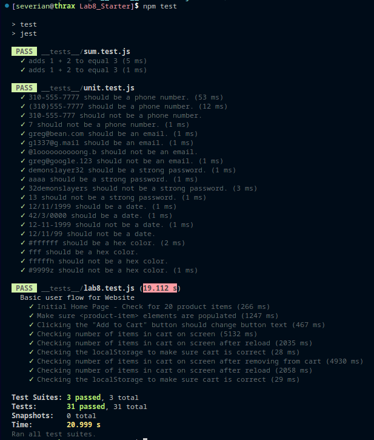

# Lab 8 - Starter

Koa Calloway

## Check Your Understanding

1) Where would you fit your automated tests in your Recipe project development pipeline? Select one of the following and explain why.

Answer: Within a Github action that runs whenever code is pushed.

Reasoning: This allows me to see the exact set of changes (conveniently grouped in a commit) that resulted in failing/passing tests. It allows for compartmentalization that is harder to do when only running tests locally. 

2) Would you use an end to end test to check if a function is returning the correct output? (yes/no)

Answer: No because this only tests the code and would be a unit test rather than an e2e test, which is concerned with UI.

3) Would you use a unit test to test the “message” feature of a messaging application? Why or why not? For this question, assume the “message” feature allows a user to write and send a message to another user.

No because even if there are discrete inputs and outputs that could be tested in the code for this feature, it is intrinsically a UI feature. The things that should be tested are harder to put into a unit test; Is there lag when writing a message? Is the user able to use the feature effectively? Are there issues with the time it takes to send and receive messages? (The last one could hypothetically be measured with a unit test but there are many confounding factors such as the devices each user is using, their internet connection, location, etc). 

4) Would you use a unit test to test the “max message length” feature of a messaging application? Why or why not? For this question, assume the “max message length” feature prevents the user from typing more than 80 characters.

This is appropriate for a unit test because it is discrete, quantifiable, and for the most part
lives entirely in the code.

## Screeenshot

